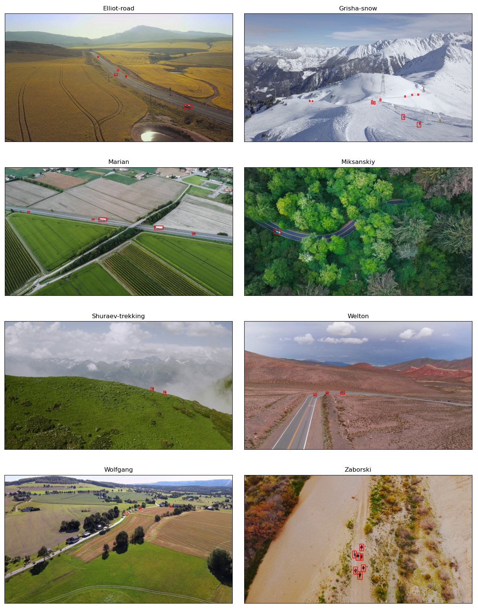

# PESMOD
**PESMOD** (**PE**xels **S**mall **M**oving **O**bject **D**etection) dataset consists of high resolution aerial images in which moving objects are labelled manually. The aim of this work is to provide a different and challenging dataset for moving object detection methods evaluation. Each moving object is labelled for each frame with PASCAL VOC format in a XML file. Dataset consists of 8 sequence detailed below.


|   Sequence name  | Number of frames | Number of moving objects |
|:----------------:|:----------------:|:------------------------:|
| Elliot-road      | 664              | 3416                     |
| Miksanskiy       | 729              | 189                      |
| Shuraev-trekking | 400              | 800                      |
| Welton           | 470              | 1129                     |
| Marian           | 622              | 2791                     |
| Grisha-snow      | 115              | 1150                     |
| Zaborski         | 582              | 3290                     |
| Wolfgang         | 525              | 1069                     |
| Total            |       4107       |           13834          |


# PESMOD

Click [here](https://drive.google.com/file/d/153fLcf4F33G3oKWYUkggBWJRP5LVHV60/view?usp=sharing) to download the dataset

# Contributions
If you find any mistakes in the labels, you can report it in the issues section.

## Script to view dataset, build and run performance code to evaluate your own method with foreground mask 

To view dataset after downloading: 

```
python view-dataset.py --path "/home/ibrahim/PESMOD/Pexels-Welton/"
```

Build performance code with following commands: 
```
cd performance
mkdir build
cmake ..
make .
```
Run with (-d for dataset main folder, -m for masks main folder, -f for sequence name, -o if you apply morphological opening):
```
./performance -d "/home/ibrahim/PESMOD/" -m "/home/ibrahim/SCBU-PESMOD-results/" -f "Pexels-Marian"
```

# Dataset sample frames


